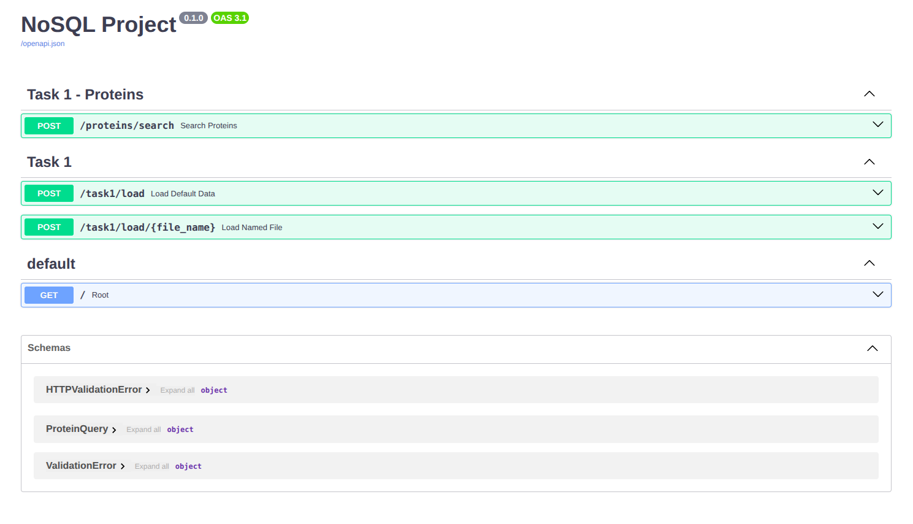

# Tache 1 (Windows) : 

## Démarrer MongoDB

    Ouvrir PowerShell en administrateur si besoin :

    Get-Service -Name MongoDB
    Start-Service -Name MongoDB
    Get-Service -Name MongoDB

    Attendu :
    Status = Running

## Lancer l’API FastAPI

    Ouvrir un terminal normal :

    cd C:\Users\amrou\NoSQL_Project\back
    uvicorn main:app --reload

    Attendu :

    Uvicorn running on http://127.0.0.1:8000

    Application startup complete

    Laisser ce terminal ouvert.

## Tester le peuplement en UNE seule requête

    Ouvrir un 2e terminal PowerShell (normal).

    IMPORTANT :
    Sous PowerShell, utiliser Invoke-RestMethod
    (car "curl -X" peut échouer).

    Commande :

    Invoke-RestMethod -Method Post -Uri "http://127.0.0.1:8000/task1/load
    "

    OU (si l’endpoint existe) :

    Invoke-RestMethod -Method Post -Uri "http://127.0.0.1:8000/task1/load/data_sample.tsv
    "

    Attendu :
    Un JSON avec un message OK et un nombre "inserted" > 0.
---


# Tache 1 (Linux) :

## Installer les dépendances : 

```bash
pip install requirements.txt
```

## Installer mongoDB et mongosh :

```bash

```

## Démarrer MongoDB

```bash
sudo systemctl enable 
```

## Lancer l’API FastAPI

```bash
uvicorn main:app --reload
```

-> Uvicorn running on http://127.0.0.1:8000


## Peuplement de la base

Aller sur l'interface de FastAPI (Swagger-UI) : http://127.0.0.1:8000/docs




Lancer la requête POST "/task1/load/"

Cela va remplir la base docuement Mongo avec les protéines contenues dans notre fichier tsv "NOSQL_PROJECT/data/data_sample.tsv". 

Réponse attendu : 

```json
{
  "message": "MongoDB populated",
  "inserted": 85979
}
```
## Recherche de protéines

A partir de cette même interface utilisateur il est possible de faire des requêtes spécifiques sur différents critères afin de retourner les protéines recherchées de la base. 

Pour ce faire utiliser la méthode POST "/proteins/search". Exemple de requête : 

```json
{
  "entry": "",
  "protein_name": "kinase",
  "entry_name": "",
  "organism": "",
  "sequence": "",
  "ec_number": "",
  "interpro": ""
}
```
Cela va retourner les documents de notre base de donnée ayant le nom de protéines "kinase".

